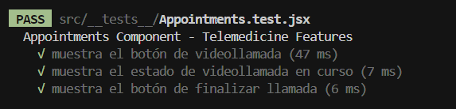
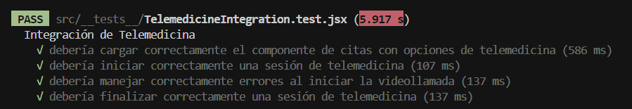

# Documentación de Pruebas Realizadas

## Tabla Resumen de Casos de Prueba

| Tipo de Prueba | Archivo                                      | Módulo Evaluado         | Caso de Prueba                                         | Datos Utilizados         | Resultado Esperado                |
|----------------|----------------------------------------------|-------------------------|--------------------------------------------------------|--------------------------|-----------------------------------|
| Unitaria       | src/__tests__/Appointments.test.jsx           | Appointments (mock)     | Muestra botón de videollamada                          | Texto estático           | Botón visible                     |
| Unitaria       | src/__tests__/Appointments.test.jsx           | Appointments (mock)     | Muestra estado de videollamada en curso                | Texto estático           | Estado visible                    |
| Unitaria       | src/__tests__/Appointments.test.jsx           | Appointments (mock)     | Muestra botón de finalizar llamada                     | Texto estático           | Botón visible                     |
| Integración    | src/__tests__/TelemedicineIntegration.test.jsx | Appointments (real)     | Carga datos de cita con telemedicina                   | Mock de cita             | Datos y opciones visibles         |
| Integración    | src/__tests__/TelemedicineIntegration.test.jsx | Appointments (real)     | Inicia sesión de telemedicina                          | Mock de cita y Jitsi     | Estado "Video call in progress"   |
| Integración    | src/__tests__/TelemedicineIntegration.test.jsx | Appointments (real)     | Maneja error al iniciar videollamada                   | Mock de error            | Mensaje de error visible          |
| Integración    | src/__tests__/TelemedicineIntegration.test.jsx | Appointments (real)     | Finaliza sesión de telemedicina                        | Mock de cita y Jitsi     | Sesión Jitsi liberada             |

---

## Instrucciones para Ejecutar las Pruebas

1. **Instalar dependencias** (si no lo has hecho):
   ```bash
   npm install
   ```
2. **Ejecutar todas las pruebas:**
   ```bash
   npm test
   ```
   o, dependiendo de la configuración:
   ```bash
   npx jest
   ```
3. **Ver reporte de cobertura (opcional):**
   ```bash
   npm run test -- --coverage
   ```
   El reporte se generará en la carpeta `/coverage`.

---

## Detalle de Pruebas

### 1. Pruebas Unitarias

**Archivo:** `src/__tests__/Appointments.test.jsx`  
**Tipo de prueba:** Unitaria  
**Módulo evaluado:** Componente `Appointments` (funcionalidades de telemedicina)

#### ¿Qué se prueba?
- Que el componente muestre correctamente los elementos clave de la funcionalidad de telemedicina:
  - El botón para unirse a la videollamada.
  - El estado de videollamada en curso.
  - El botón para finalizar la llamada.

#### ¿Cómo se prueba?
- Se utiliza un componente mock (`MockAppointments`) que simula la interfaz de telemedicina.
- Se renderiza el componente usando `@testing-library/react` y se verifica la presencia de los textos esperados en pantalla.
- Se mockean las funciones de la API y la integración con Jitsi.

#### ¿Con qué datos?
- No se utilizan datos dinámicos, sino que se verifica la presencia de textos estáticos como:
  - `"Join video call"`
  - `"Video call in progress"`
  - `"End call"`

#### Resultado esperado
- Todas las pruebas pasan si los elementos mencionados aparecen correctamente en el DOM.

---

### 2. Pruebas de Integración

**Archivo:** `src/__tests__/TelemedicineIntegration.test.jsx`  
**Tipo de prueba:** Integración  
**Módulo evaluado:** Página `Appointments` y su integración con la API y la videollamada (Jitsi)

#### ¿Qué se prueba?
- Que el componente de citas carga correctamente los datos de una cita con opción de telemedicina.
- Que se puede iniciar una sesión de telemedicina (videollamada) correctamente.
- Que se maneja adecuadamente un error al intentar iniciar la videollamada.
- Que se puede finalizar correctamente una sesión de telemedicina.

#### ¿Cómo se prueba?
- Se mockean todas las dependencias externas: API de backend (`fetchAppointments`, `fetchDoctorJitsiInfo`, etc.), componentes de UI y la API de Jitsi.
- Se simula la interacción del usuario: clic en la fila de la cita, clic en el botón de videollamada, y clic en el botón para finalizar la llamada.
- Se utilizan funciones de testing como `render`, `fireEvent`, y `waitFor` para simular y verificar el flujo completo.

#### ¿Con qué datos?
- Se utilizan datos mock para una cita:
  - **Paciente:** Nombre, Email, Género, Grupo sanguíneo.
  - **Problema:** `"Test Problem"`
  - **Modalidad:** `"Virtual"`
  - **Estado:** `"scheduled"`
  - **Fecha:** `"2024-03-20"`
  - **Servicio:** `"Telemedicina"`, Precio: `100`
  - **Slot:** Hora `"10:00"`
- Para la videollamada, se mockea la respuesta de la API con:
  - `meeting_id`, `meeting_url`, `token`

#### Resultado esperado
- El componente muestra correctamente los datos de la cita y las opciones de telemedicina.
- Al iniciar la videollamada, se llama a la API y se muestra el estado `"Video call in progress"`.
- Si ocurre un error al iniciar la videollamada, se muestra un mensaje de error.
- Al finalizar la llamada, se libera correctamente la sesión de Jitsi.

---

## Resultados

A continuación se muestran capturas de pantalla de los resultados de las pruebas:

### Prueba de cita (Appointment)



### Prueba de telemedicina (Telemedicine)



---

## Resumen

- **Tipo de pruebas:** Unitarias y de integración.
- **Módulos evaluados:** Componente y página de citas (`Appointments`), integración con API y Jitsi.
- **Datos utilizados:** Datos mock de pacientes, citas y videollamadas.
- **Resultados:** Todas las pruebas están diseñadas para pasar si el flujo de telemedicina funciona correctamente y los errores se manejan adecuadamente.