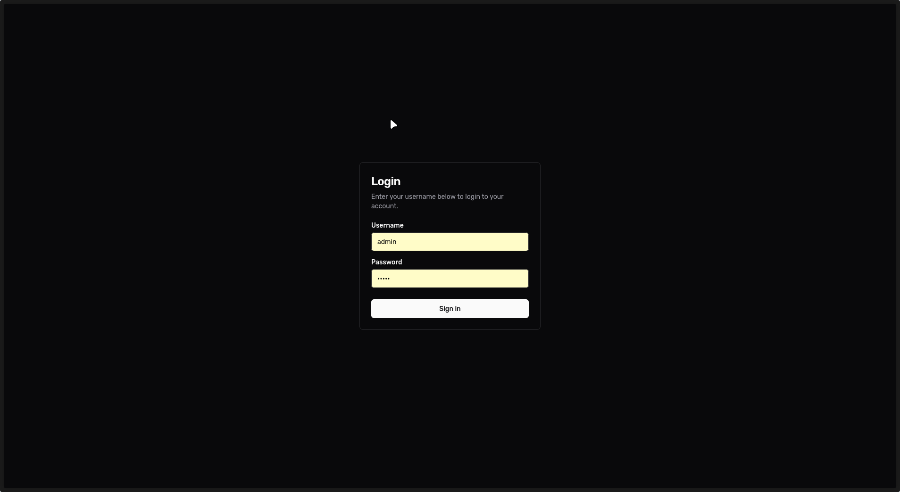
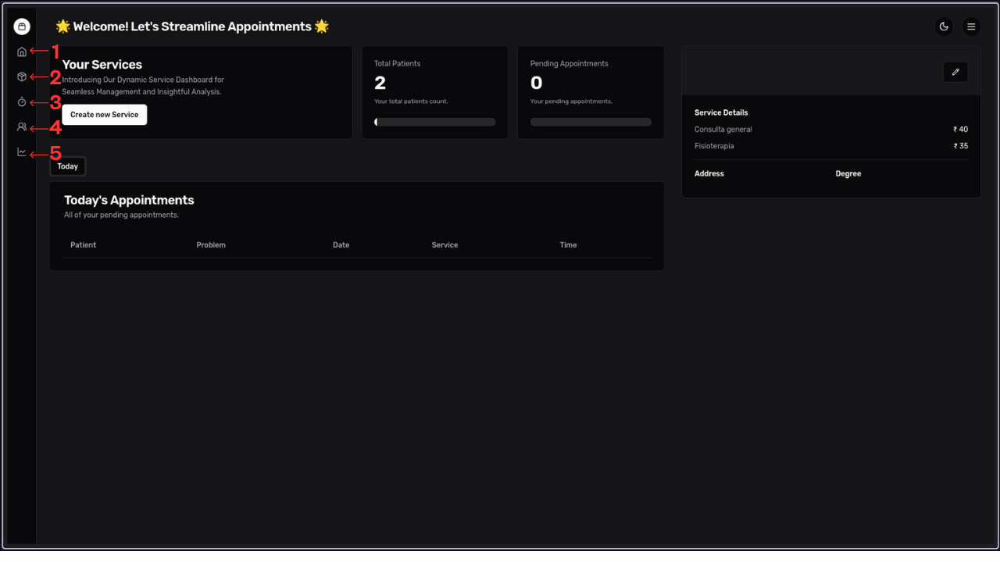
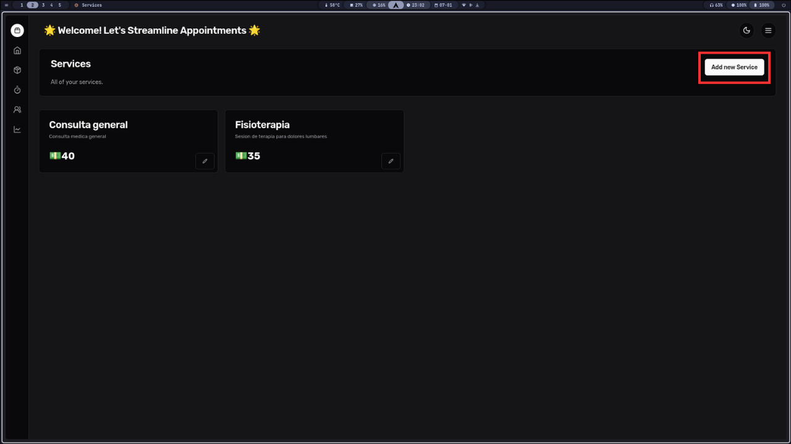

# Manual de Usuario – Sistema de Registro de Citas para Pacientes

## Índice

- [Inicio de sesión](#inicio-de-sesión)
- [Navegación](#navegación)
- [Manejo de servicios](#manejo-de-servicios)
- [Espacios de citas o Slots](#espacios-de-citas-o-slots)
- [Pacientes](#pacientes)
- [Módulo de citas](#módulo-de-citas)
- [Acceder a una cita virtual](#acceder-a-una-cita-virtual)
- [Correos electrónicos](#correos-electrónicos)

---

## Inicio de sesión

Una vez accedida la dirección de nuestra página web, se mostrará un log in donde se deben completar los campos de usuario (`username`) y contraseña (`password`).  
Luego de introducir la información, haz clic en el botón **“Sign in”**.

---

## Navegación

Después de iniciar sesión, se mostrará una vista con:

- **Barra lateral de navegación:** permite desplazarse entre los módulos:
  - Dashboard
  - Services
  - Slots
  - Patients
  - Appointments

Esta barra permanece visible al cambiar entre módulos.

- **Dashboard:** vista principal (1).
- **Módulo Agregar Servicios:** permite añadir nuevos servicios (2).
- **Total de pacientes:** muestra el total de pacientes registrados (3).
- **Total de citas pendientes:** indica cuántas citas hay agendadas para el día actual que aún no se han atendido (4).
- **Detalle de servicios:** lista los servicios ofrecidos junto a su precio (5).

---

## Manejo de servicios

Dentro del módulo **Services**, se visualizan tarjetas con el nombre, descripción y precio de cada servicio.

Para agregar uno nuevo:

1. Haz clic en **“Add new Service”**.
2. Completa los siguientes campos:
   - Nombre del servicio
   - Descripción del servicio
   - Precio
3. Haz clic en **“Add Service”** para guardar o **“Cancel”** para cancelar.

Si todo se realizó de forma correcta, podrá visualizar la nueva tarjeta con el servicio agregado.

---

## Espacios de citas o Slots

En el módulo **Slots**, se gestionan los espacios de atención. 

Se visualizan tarjetas que especifican las franjas de tiempo en el que se atienden las citas.

Haz clic en **“Add new Slot”** para registrar un nuevo horario.

- Especifica el rango horario en formato de 24 horas (ej: `13:00 – 13:30`).
- Haz clic en **“Add Slot”** para guardar o **“Cancel”** para cancelar.

El nuevo slot aparecerá como una tarjeta en la vista principal.

---

## Pacientes

Se muestra una lista de pacientes registrados.

- Usa la barra de búsqueda para filtrar por nombre.
- Usa los botones **“Previous”** y **“Next”** para cambiar de página.
- Haz clic en **“Add new Patient”** para registrar un paciente nuevo.

### Formulario para nuevo paciente:

Es necesario completar la siguiente información:

- Nombre
- Correo
- Teléfono
- Dirección
- Género
- Grupo sanguíneo

Haz clic en **“Add Patient”** para guardar o **“Cancel”** para cancelar.

---

## Módulo de citas

Se muestra una lista de citas agendadas para el día actual.

- Usa la barra de búsqueda para buscar por enfermedad o problema.
- Usa **“Previous”** y **“Next”** para cambiar de página.
- Haz clic en **“Add new Appointment”** para registrar una nueva cita.

### Formulario de nueva cita:

Es necesario completar la siguiente información:

- Selección de paciente
- Selección de servicio
- Selección de slot
- Problema o enfermedad
- Fecha
- Modalidad (presencial o virtual)

Haz clic en **“Add Appointment”** para guardar o **“Cancel”** para cancelar.

---

## Acceder a una cita virtual

Para unirse a una cita virtual:

1. En el módulo **Appointments**, haz clic sobre la cita correspondiente.
2. Haz clic en **“Join video call”** para desplegar el módulo de videollamada.
3. Luego, haz clic en **“Join meeting”**.

**Consideraciones:**

- Solo disponible durante el horario de la cita.
- El paciente no puede unirse antes que el doctor.
- La llamada se cierra si el doctor abandona la sala.

### Finalizar la cita

- El doctor debe agregar una prescripción para finalizar.
- Haz clic en **“Add prescription”**, escribe y guarda.

---

## Correos electrónicos

El paciente recibirá:

- **Correo de confirmación:** con fecha y hora de la cita.

- **Correo recordatorio:** el día de la cita, incluye el enlace a la videollamada.

